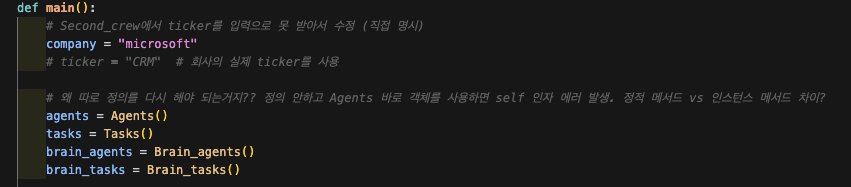
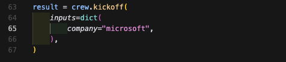

# RAGA_LAB
# stock_decision_MAS in RAGA Lab
## MAS : Multi Agent System  

 

  

 

  

## Back Test

---
## Execute  

### **뇌모듈 MAS**  
### 1. run.py에서 company를 원하는 회사명으로 변경  

 

     

### 2. run.py 실행  

### 3. Agent 대화 로그 실시간 확인 (각 출력 결과물 확인 - 신뢰도 체크, 에러 없어야 함)  

### 4. 6/12 MONTH_PRICE_TARGET 추출  
(구글 스프레드 시트에 기록)  

### **노마더코더 MAS**  
### 1. run2.py에서 company를 원하는 회사명으로 변경  

 

     

### 2. run2.py 실행  

### 3. Agent 대화 로그 실시간 확인 (각 출력 결과물 확인 - 신뢰도 체크, 에러 없어야 함)  

### 4. investment_recommendation.md 에서 6/12 MONTH_PRICE_TARGET 추출 
(구글 스프레드 시트에 기록)  

---